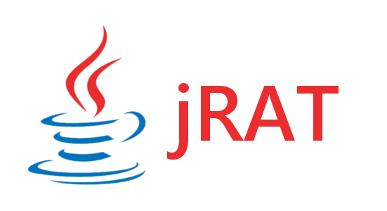

<<<<<<< HEAD
<<<<<<< HEAD

***

jRAT is a Remote Administration Tool written in Java supporting all major operating systems (Windows, Mac OS X, Linux, Solaris, BSD, ...)

[**Website**](https://jrat.io) **|** [**Docs**](https://github.com/java-rat/docs) **|** [**Twitter**](https://twitter.com/java_rat) **|** [**Binaries/Downloads**](https://jrat.io/downloads.php) **|** [**Changelog**](/CHANGELOG.md) **|**
[**API**](https://github.com/java-rat/api)  **|** [**Support, Help and Suggestions**](https://jrat.io/support.php)

## Components

- [Controller](Controller/)
- [Common](Common/)
- [Stub](Stub/)

### Others

- [Extractor](Extractor/) - Graphical installer, downloads the latest version and extracts it
- [Updater](Updater/) - Silently downloads the latest version and overwrites all old files in the current directory

## Tested systems

| Name	  							| File
| ---         						| :---
| Windows 10 Technical Preview		| WindowsTechnicalPreview-9879-x64-EN-US.iso
| Windows 8.1 Pro					| en_windows_8.1_professional_vl_with_update_x64_dvd_4065194.iso
| Windows 7							| _unknown_
| Windows XP Professional			| _unknown_
| Mac OS X 10.10 Yosemite			| _unknown_
| Mac OS X 10.9 Mavericks			| _unknown_
| Mac OS X 10.8 Mountain Lion		| _unknown_
| Ubuntu 14.04						| ubuntu-14.04.1-desktop-amd64.iso
| Ubuntu 12.04						| ubuntu-12.04.3-desktop-amd64.iso
| Fedora 21							| Fedora-Live-Workstation-x86_64-21-5.iso
| Linux Mint 17						| linuxmint-17.1-cinnamon-64bit.iso
| elementary OS	Freya				| elementaryos-freya-amd64.20150411.iso
| elementary OS	Luna				| elementaryos-stable-amd64.20130810.iso
| CentOS 6.5						| CentOS-6.5-x86_64-bin-DVD1.iso
| CentOS 7							| CentOS-7.0-1406-x86_64-DVD.iso
| openSUSE							| openSUSE-13.2-DVD-x86_64.iso
| Kali Linux						| kali-linux-1.0.5-amd64.iso
| Debian 7							| debian-7.8.0-amd64-netinst.iso
| Manjaro 0.8.12 Ascella			| manjaro-xfce-0.8.12-x86_64.iso
| Peppermint 6						| Peppermint-6-20150518-amd64.iso
| FreeBSD (PCBSD)					| PCBSD10.1.1-RELEASE-01-31-2015-x64-DVD-USB.iso
| OpenBSD							| install56.iso
| Solaris 11						| sol-11_2-live-x86.iso
| OpenIndiana						| oi-dev-151a-x86.iso

## Credits

- [redpois0n](https://redpois0n.com) - [red@cmail.nu](red@cmail.nu)
- [IP2Country](http://firestats.cc/wiki/ip2c)
- [DraggableTabbedPane](http://java-swing-tips.blogspot.se/2008/04/drag-and-drop-tabs-in-jtabbedpane.html)

## About

jRAT was started approximately 14th July 2012 and was released approximately 22th August 2012 for the first time

First commit using git was made first June 2013

jRAT has been paid and free many times, as I write this, jRAT is paid.

When this source finally gets publiced, I hope that the community will contribute so this gets better and better.